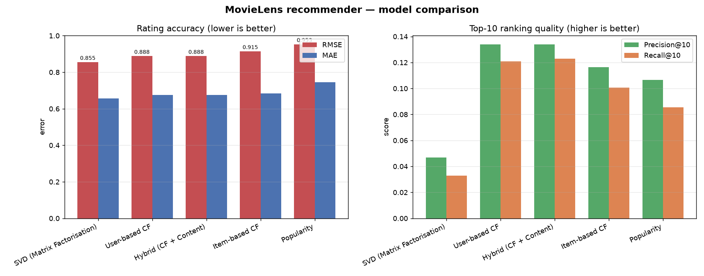

 movie recommendation engine built with **collaborative filtering** on the
  

[MovieLens `ml-latest-small`](https://grouplens.org/datasets/movielens/) dataset
hips with both a **CLI** and a **Streamlit web app**.
**cold-start** problem, explains its picks (*"because you liked X, Y, Z"*), and




---

✨ Highlights

- **5 models, one interface** — popularity baseline, user-based CF, item-based CF,
 a bonus
implicit-feedback model).
 **Proper evaluation** — RMSE, MAE, precision@k, recall@k and hit-rate@k on a
   held-out test set, in one comparison table + chart.
- **Real recommender features**
  - `get_recommendations(user_id, n)` with human-readable **explanations**
  - `get_similar_movies(movie_id, n)` — content, collaborative, or hybrid
  - **Cold-start** handled two ways: popularity fallback *and* new-user fold-in
    (no retraining)
- **Two front-ends** — a scriptable CLI and a polished Streamlit app.
- **Runs anywhere** — if `scikit-surprise` won't build on your platform, the SVD
  model transparently falls back to a built-in NumPy implementation.

## 📊 Results (test set)

| Model | RMSE ↓ | MAE ↓ | Precision@10 ↑ | Recall@10 ↑ | HitRate@10 ↑ |
|---|---|---|---|---|---|
| **SVD (Matrix Factorisation)** | **0.855** | **0.657** | 0.047 | 0.033 | 0.295 |
| **Hybrid (CF + Content)** | 0.888 | 0.676 | **0.134** | **0.123** | **0.643** |
| User-based CF | 0.888 | 0.676 | 0.134 | 0.121 | 0.618 |
| Item-based CF | 0.915 | 0.683 | 0.117 | 0.101 | 0.576 |
| Popularity (baseline) | 0.953 | 0.744 | 0.107 | 0.086 | 0.508 |

> **SVD** is the best *rating predictor*; the **Hybrid** builds the best *top-N lists*.
> Full analysis in **[REPORT.md](REPORT.md)** and
> [`notebooks/model_comparison.ipynb`](notebooks/model_comparison.ipynb).

---

## 🚀 Quickstart

```bash
# 1. clone, then create an environment
python -m venv .venv
# Windows:
.venv\Scripts\activate
# macOS / Linux:
source .venv/bin/activate

# 2. install dependencies
pip install -r requirements.txt

# 3. download the dataset (~1 MB) and train + evaluate all models
python -m scripts.download_data
python -m scripts.train

# 4a. explore from the command line
python cli.py recommend 42
python cli.py similar "The Matrix"

# 4b. …or launch the web app
streamlit run app.py
```

`scripts.train` writes the metrics table, the comparison chart, and a cached model
(`artifacts/recommender.pkl`) so the CLI and app start instantly. The apps will also
build the cache on first run if it's missing.

---

## 🖥️ CLI usage

```bash
python cli.py recommend 42                    # top-10 personalised picks (+ why)
python cli.py recommend 42 -n 5 --model "SVD (Matrix Factorisation)"
python cli.py similar "Matrix"                # movies similar to The Matrix
python cli.py similar 1 --method content      # by movieId, content-based
python cli.py newuser "Toy Story" "Matrix"    # simulate a brand-new user (cold start)
python cli.py profile 42                      # a user's own top-rated movies
python cli.py search "star wars"              # find movie ids
python cli.py popular                         # popularity chart / cold-start list
python cli.py compare                         # model comparison table
```

Example:

```
$ python cli.py recommend 42 -n 4
Top 4 recommendations for user 42 (model: Hybrid (CF + Content)):

 title                                              genres                   score  why
 American Beauty (1999)                             Drama|Romance            0.755  Because you liked The Piano, Cocktail, …
 Star Wars: Episode VI - Return of the Jedi (1983)  Action|Adventure|Sci-Fi  0.753  Because you liked Demolition Man, The Abyss, …
 Saving Private Ryan (1998)                         Action|Drama|War         0.737  Because you liked The Thin Red Line, Red Dawn, …
 Fargo (1996)                                       Comedy|Crime|Drama       0.735  Because you liked Jackie Brown, …
```

## 🌐 Streamlit app

```bash
streamlit run app.py
```

Four sections:

- **🎯 Recommendations** — pick a user + model, see their top-N with explanations and
  their own favourites side-by-side.
- **🔎 Similar Movies** — search a title, then get similar movies (content / CF / hybrid).
- **🆕 New User (cold start)** — choose a few movies you like and get folded into the
  model with no retraining.
- **📊 Model Comparison** — interactive RMSE / MAE / precision / recall charts.

---

## 🧠 How it works

### Data pipeline (`src/data.py`)
Load → clean (nulls, dupes, scale, unknown movies) → iteratively filter users/movies
with `< 5` ratings → per-user 80/20 split → sparse `users × movies` matrix + index maps.

### Models (`src/models.py`)
All share one interface: `fit(dataset)`, `predict(user, movie)` (for RMSE/MAE) and
`recommend(user, n)` (for top-N).

| Model | Similarity / method | Notes |
|---|---|---|
| `PopularityRecommender` | IMDB weighted rating | baseline + cold-start fallback |
| `UserBasedCF` | cosine between users (mean-centred) | support-shrunk ranking |
| `ItemBasedCF` | adjusted cosine between movies | exposes `similar_items()` |
| `MatrixFactorizationCF` | SVD (Funk MF) | `surprise` backend, NumPy fallback |
| `HybridRecommender` | CF ⊕ content (genres + tags TF-IDF) | best top-N ranker |
| `ImplicitCF` | co-occurrence on implicit signal | bonus / stretch goal |

**Ranking shrinkage.** Neighbourhood CF loves to top-rank obscure items backed by a
single enthusiastic neighbour. When *ranking* (not when predicting a rating) each
score is shrunk toward the user's mean by `support / (support + β)`, which lifts
precision@10 from ~0.01 to ~0.13.

### Content features (`src/content.py`)
One TF-IDF vector per movie from its genres + user tags. Powers the hybrid model, the
content-based "similar movies", and the explanations.

### Evaluation (`src/evaluation.py`)
RMSE & MAE over test ratings; precision@k / recall@k / hit-rate@k over a top-N protocol
where "relevant" = test movies the user rated `≥ 4.0`.

### Facade (`src/recommender.py`)
`RecommenderSystem` ties it together: `get_recommendations`, `get_similar_movies`,
`recommend_for_new_user`, `explain`, `search_movies`, plus save/load caching.

---

## 📁 Project structure

```
movie-recommender/
├── app.py                       # Streamlit web app
├── cli.py                       # command-line interface
├── requirements.txt
├── README.md  /  REPORT.md      # docs + model comparison write-up
├── src/
│   ├── config.py                # all tunables in one place
│   ├── data.py                  # load / clean / filter / split / index
│   ├── content.py               # genres + tags TF-IDF features
│   ├── models.py                # the 6 models + shared interface
│   ├── evaluation.py            # RMSE, MAE, precision@k, recall@k
│   └── recommender.py           # high-level facade used by the apps
├── scripts/
│   ├── download_data.py         # fetch + extract the dataset
│   └── train.py                 # evaluate all models, save artifacts
├── notebooks/
│   └── model_comparison.ipynb   # interactive report
├── tests/
│   └── test_pipeline.py         # sanity tests
├── data/                        # dataset (downloaded, git-ignored)
├── artifacts/                   # metrics.csv + cached model (generated)
└── assets/                      # comparison chart (generated)
```

---

## ☁️ Deploy the app for free

**Streamlit Community Cloud** (free):

1. Push this repo to GitHub.
2. On [share.streamlit.io](https://share.streamlit.io), create an app pointing at
   `app.py`.
3. On first launch the app downloads the dataset and trains the models automatically
   (the model cache is git-ignored, so it's rebuilt in the cloud).

> If `scikit-surprise` fails to build in the cloud, remove it from
> `requirements.txt` — the SVD model falls back to the built-in NumPy
> implementation with no code changes.

---

## 🛠️ Tech stack

Python · pandas · numpy · scipy (sparse matrices) · scikit-learn · scikit-surprise ·
matplotlib · plotly · Streamlit — all free and open source.

## 🧪 Tests

```bash
python -m pytest -q        # or: python tests/test_pipeline.py
```

## 📚 Dataset & credits

MovieLens data © [GroupLens Research](https://grouplens.org/datasets/movielens/).
> F. Maxwell Harper and Joseph A. Konstan. 2015. *The MovieLens Datasets: History and
> Context.* ACM TiiS 5, 4. https://doi.org/10.1145/2827872

Built for learning / demonstration. MIT-licensed — see `LICENSE`.